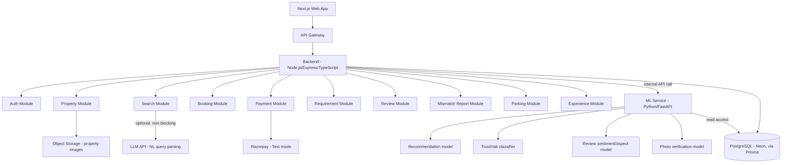

# Vistara — Day 15: System Architecture

> Corrected — added the FastAPI ML service that the project's own 90-Day Roadmap specifies but this document previously omitted.

## 1. Architecture Objective

Define the application layer, backend structure, and — corrected — the dedicated ML service architecture, since Vistara's scope includes real ML components (recommendation, trust/risk, review intelligence, photo verification), not just a single API call.

## 2. Architecture Style

**Two services**, not one, not a full microservice sprawl:
1. **Main backend** (Node.js/Express/TypeScript) — modular monolith handling all transactional domains
2. **ML service** (Python/FastAPI) — serves recommendation, risk score, review summary, and photo-verification predictions

This matches the roadmap's explicit deliverable list ("FastAPI ML service") while still avoiding unnecessary microservice decomposition of the transactional side.

## 3. High-Level Architecture

## 4. Why Two Services, Not One and Not Many

A single Node backend has no natural way to run Python-based ML models (scikit-learn, embeddings, image-similarity libraries) without significant workarounds. A dedicated FastAPI service is the standard, low-overhead way to serve these models, and matches what the roadmap already specifies as a Data Science deliverable. Beyond this split, there is still no justification for further microservice decomposition — both services remain single deployable units.

## 5. Module/Service Responsibilities

| Component | Responsibility |
|---|---|
| Auth, Property, Search, Booking, Payment, Requirement, Review, Mismatch Report, Parking, Experience (backend modules) | Transactional platform logic |
| Recommendation model (ML service) | Ranked property suggestions, Phase 5 baseline -> Phase 8 personalization |
| Trust/risk classifier (ML service) | Risk indicator from booking/mismatch/verification signals, Phase 6 |
| Review sentiment/aspect model (ML service) | Structured review summaries, Phase 7 |
| Photo verification model (ML service) | Duplicate/consistency detection on property images, Phase 7 |

## 6. Data Flow Principle

The backend calls the ML service internally (server-to-server, not exposed to the frontend directly) and validates/wraps ML output before returning it to the client — matching NFR-AI-04/05 from Day 10 (AI output never directly controls critical operations without backend validation).

## 7. Day 15 Conclusion

Architecture now correctly reflects a two-service system: a transactional backend and a dedicated ML service, matching the roadmap's own specified deliverables instead of omitting the ML service entirely.

Next: Day 16 — Database design (corrected with ML-supporting tables).