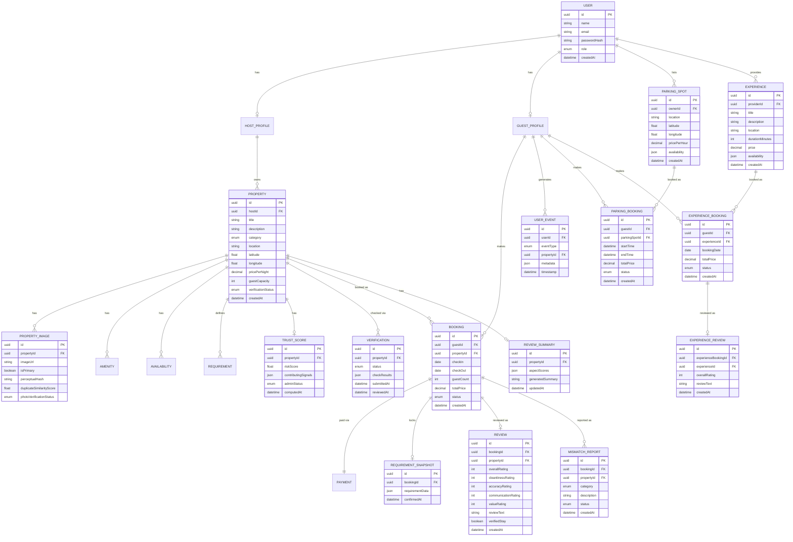

# Vistara — Day 16: Database Design

> Corrected — added USER_EVENT, trust/risk fields, and photo-verification metadata, previously omitted as "not needed for MVP."

## 1. Objective

Schema supporting every FR from Day 9 (corrected), including the ML-supporting tables Phase 5-7 actually need.

## 2. Entity-Relationship Diagram

## 3. Key Design Decisions (Corrected Additions)

- **USER_EVENT** logs search, view, save, and booking-start events — required for Phase 5 recommendation features and Phase 8 personalization. Without this table, there is no data for the recommendation model to train on.
- **PROPERTY_IMAGE now carries perceptualHash and duplicateSimilarityScore** — required for Phase 7's photo verification model. This replaces the earlier, incorrect plan to verify hosts via uploaded ID documents.
- **VERIFICATION is a record created automatically** when property images are uploaded (not a form the host fills out) — `status`, `checkResults`, and timestamps let the admin queue (Day 17's `/admin/verification/:id/decide`) operate on a real record instead of an endpoint with nothing behind it. `PROPERTY.verificationStatus` is a denormalized copy of the latest VERIFICATION.status, kept for fast listing-page display.
- **TRUST_SCORE** is a separate table, not a field bolted onto PROPERTY, because it needs its own computation timestamp and a record of contributing signals (for admin explainability, matching NFR-USE-03's "no unexplained alarming status" rule).
- **REVIEW_SUMMARY** stores the Phase 7 output (aspect scores, generated summary) per property, refreshed as new reviews arrive — not computed live on every page load.
- **Requirement snapshot and mismatch report design are unchanged** from the original Day 16 — these were correct.
- **Parking and Experience are separate entity families**, not shoehorned into PROPERTY, because they have genuinely different attributes (hourly pricing + time-slot booking for parking; duration + date-slot booking for experiences).
- **PARKING_BOOKING and EXPERIENCE_BOOKING are separate from BOOKING** (the property booking table) for the same reason — different lifecycle fields. All three reuse the same status enum values (PENDING/CONFIRMED/CANCELLED/COMPLETED) for consistency.

## 4. Still Not in This Schema

No tables for business/certificate verification, cleaning/chef/photography "Services" (distinct from Experiences, still excluded), trip planning, group travel, or travel-agency features — confirmed excluded per Day 8 and `Vistara-Major-Future-Roadmap.md`.

## 5. Day 16 Conclusion

23 tables now: the original 18, plus PARKING_SPOT, PARKING_BOOKING, EXPERIENCE, EXPERIENCE_BOOKING, EXPERIENCE_REVIEW — each traceable to Gap 7 or Gap 8 from the corrected Day 3.

Next: Day 17 — API design (corrected with ML service contract, now including Parking/Experience endpoints).