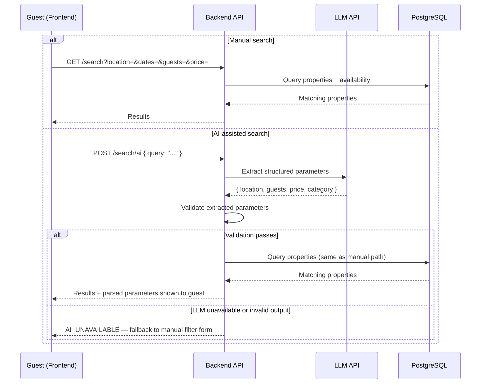

# Vistara — Day 18: Map & Search Design

## 1. Objective

Define how search (manual and AI-assisted) and map display work together, and lock the maps/geocoding provider decision flagged as open in Day 12.

## 2. Maps Provider Decision

Per Day 12, the choice was left open pending cost confirmation. Locking it now for MVP:

**Decision: Google Maps Platform**, using the India-specific free monthly threshold noted in Day 12's research, with usage monitored during development. Rationale: reliable geocoding accuracy for Indian addresses, acceptable free tier for a demo-scale seed dataset (30–50 properties), and avoids the public Nominatim rate-limit constraints (1 req/sec, no client-side autocomplete) that would be awkward for a live search UI.

If usage approaches the free threshold during testing, fallback is a self-cached geocoding layer (geocode once at property creation, store lat/lng — do not re-geocode on every search).

## 3. Search Flow

## 4. Why AI Search Reuses the Manual Query Path

The AI step only produces structured parameters — it never queries the database directly. This means the manual and AI search paths converge on the same, single, well-tested query logic. There is exactly one search implementation to maintain, not two.

## 5. Map Display

- Property coordinates (lat/lng), geocoded once at listing creation, stored on the PROPERTY table (Day 16)
- Search results page shows a synced list + map: selecting a list item highlights its map marker and vice versa
- No routing/travel-time calculation in MVP — that requirement belongs to the location-intelligence idea explicitly parked in `Vistara-Major-Future-Roadmap.md`, not this scope

## 5a. Parking & Experience Search (New — Gaps 7, 8)

Both reuse the same Google Maps Platform decision and geocoding pattern locked in Section 2 — no separate provider or map integration needed:
- `GET /parking-spots/search?near=` (Day 17) resolves `near` to lat/lng the same way property search does, then queries PARKING_SPOT by proximity
- `GET /experiences/search?destination=` resolves destination the same way, queries EXPERIENCE by location match
- Map display (Section above) can optionally overlay parking/experience markers alongside property markers on the same results map — a UI decision for Phase 3, not a new architecture decision here

## 6. Day 18 Conclusion

Maps provider is locked (Google Maps Platform, cost-monitored). Search has one query implementation with two entry points (manual, AI-assisted), and AI failure never blocks the core search experience — directly satisfying NFR-AI-03/AI-06 from Day 10.

Next: **Day 19 — Booking & payment design**.