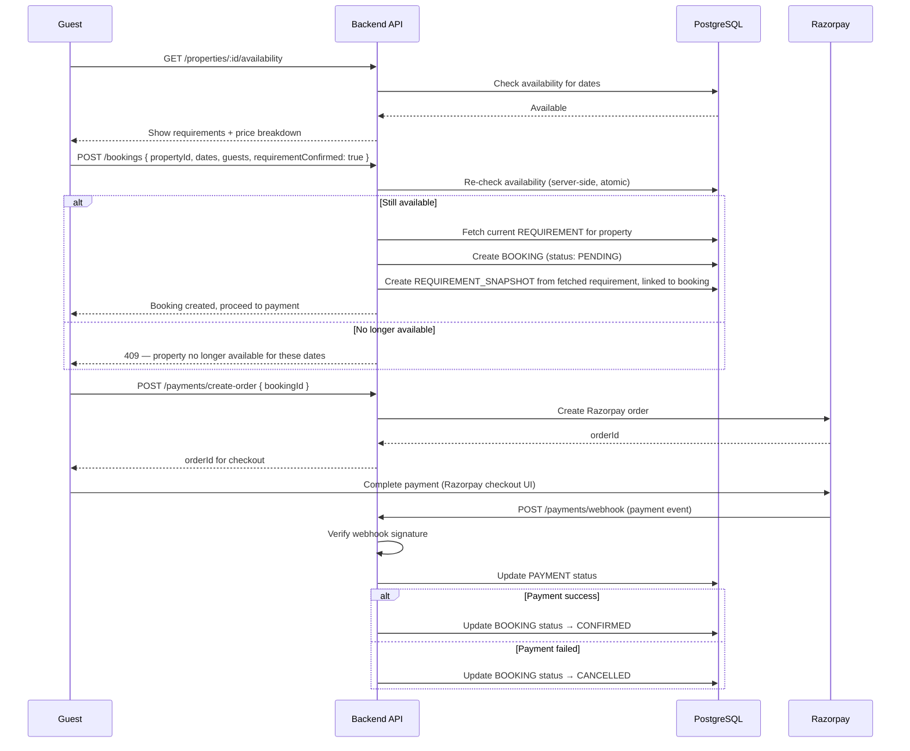

# Vistara — Day 19: Booking & Payment Design

## 1. Objective

Define the exact sequence from availability check through payment confirmation, including where the requirement snapshot (Vistara's core trust mechanism) gets written.

## 2. Booking + Payment Sequence

## 3. Key Design Decisions

- **Availability is checked twice** — once for display, once atomically at booking creation — to prevent a race condition where two guests book overlapping dates simultaneously. This directly implements NFR-DATA-02 (Day 10).
- **Requirement snapshot is created in the same transaction as the booking**, from the live REQUIREMENT row at that exact moment. This is what makes FR-REQ-04 actually enforceable — the snapshot can never drift from what the guest saw, because it's written server-side, atomically, before the guest ever sees a payment screen.
- **Booking starts PENDING, only becomes CONFIRMED after payment webhook confirms success** — never optimistically confirmed on the client's say-so. This satisfies NFR-PAY-SEC-02 (Day 10).
- **Webhook signature verification is mandatory** before trusting any payment status update — without it, anyone could POST a fake "success" event.

## 4. Cancellation (Basic, MVP Scope)

- Guest-initiated cancellation before check-in: booking status → CANCELLED, refund handling manual/admin-assisted for MVP (no automated refund logic — flagged as a known simplification, not a gap, since Day 8 never committed to automated refunds)

## 4a. Parking & Experience Bookings Follow the Same Pattern (New — Gaps 7, 8)

`PARKING_BOOKING` and `EXPERIENCE_BOOKING` (Day 16) use the identical sequence above, substituting the relevant entity:
- Parking: double-check availability (no overlapping `startTime`/`endTime` for the same `PARKING_SPOT`) atomically at booking creation — same race-condition risk as property double-booking, same fix
- Experience: double-check capacity for the requested `bookingDate` atomically at booking creation
- Both reuse `/payments/create-order` and the same webhook-confirmation flow — no separate payment logic needed
- Neither has a requirement snapshot (Requirements/FR-REQ are property-specific) — this step is simply skipped for these two booking types

## 5. Day 19 Conclusion

The booking+payment flow enforces the two things that actually matter for Vistara's thesis: no double-booking, and no way for the requirement snapshot to be anything other than exactly what the guest confirmed.

Next: **Day 20 — ML pipeline design**.